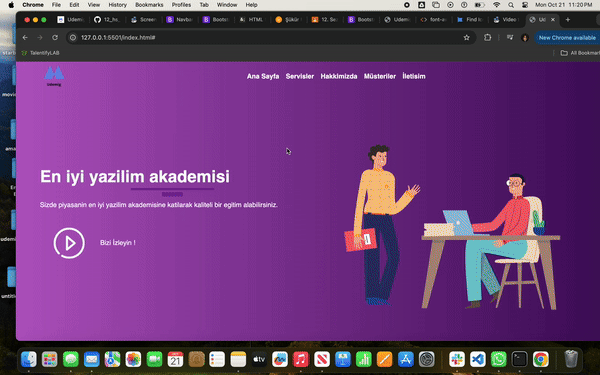

# Educational Website Project

<h4>This project is a basic-level educational website that prioritizes user comfort. The structure of the site was built using HTML, styled with CSS, and enhanced with the Bootstrap framework for responsiveness and design consistency.</h4>

<h1>Features:</h1>

<h4><h1>Clean Structure:</h1> The HTML provides a well-organized skeleton for the website.</h4>

<h4><h1>Responsive Design:</h1>With the help of Bootstrap, the website adjusts seamlessly across different screen sizes.</h4>

<h4><h1>User-Centered Design:</h1>The focus is on delivering a comfortable and accessible user experience.</h4>

<h1>Technologies Used:</h1>

<h4><h1>HTML5:</h1>For creating the basic structure of the site.</h4>

<h4><h1>CSS3:</h1>For custom styling and layout adjustments.<h4>

<h4><h1>Bootstrap:</h1>For grid layout, components, and responsive design.</h4>

#Live Demo

